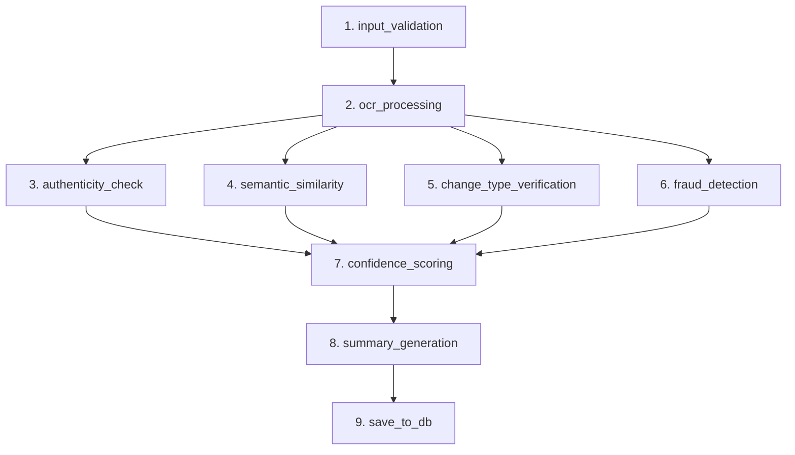

# Deep Dive: Agent Design & Prompt Engineering in IASW

The Intelligent Account Servicing Workflow (IASW) utilizes a **hybrid multi-agent architecture** orchestrated by LangGraph. By breaking down the complex task of document verification into smaller, autonomous tasks handled by specialized nodes, the system ensures high accuracy, prevents LLM hallucinations, and executes highly optimized parallel processes.

Below is an exhaustive, granular breakdown of the graph's execution state, every agent's internal logic, and the prompt engineering strategies utilized.

---

## 1. Graph Orchestration & State Management
LangGraph operates on a shared `IASWState` dictionary that is passed sequentially through the nodes. 

### The Graph Architecture (Mermaid Diagram)

*Note: Nodes 3, 4, 5, and 6 execute in parallel (Fan-out), significantly reducing processing time before fanning back into Node 7.*

---

## 2. Node Agent Breakdowns

### Node 1: Input Validation (`input_validation`)
**Role:** The Gatekeeper
**Internal Logic:** 
Validates that the incoming `IASWState` payload contains `customer_id`, `change_type`, `old_value`, `new_value`, and `file_bytes`. It sanitizes strings (trimming whitespace) and raises a hard `ValueError` if required fields are absent, preventing expensive downstream API calls.

### Node 2: OCR Processing Agent (`ocr_processing`)
**Role:** The Vision Extractor
**Internal Logic:**
- **Primary Engine:** Makes a `requests.post()` call to the **OCR.space REST API** (Engine 2, optimized for printed text). 
- **Quality Assessment:** Before OCR, it computes the Laplacian variance of the image array via OpenCV. If the variance is extremely high (crisp image), the `ocr_quality` score approaches `1.0`. If the image is washed out, it drops toward `0.0`.
- **Fallback:** If `USE_MOCK_OCR=true` or the API fails, it injects deterministic, hardcoded templates based on the `change_type`.

### Node 3: Authenticity Engine Agent (`authenticity_check`)
**Role:** The Document Structure Verifier
**Internal Logic:**
Calculates a 5-layer score (0.0 to 1.0):
1. **Template Validation:** Checks for required metadata fields based on predefined document types (e.g., Aadhaar cards require "Government of India").
2. **Completeness:** Assesses if the document text length is plausible (too short implies a cropped or fraudulent document).
3. **OCR Quality Proxy:** Integrates the quality score from Node 2.
4. **Data Consistency:** Checks for unnatural character clustering (e.g., missing spaces or corrupted bytes).
5. **Tampering Heuristics:** Scans the text for signs of digital artifacts that OCR engines typically produce when reading photoshopped text.

### Node 4: Semantic Similarity Agent (`semantic_similarity`)
**Role:** The NLP Template Matcher
**Internal Logic:**
- Embeds the raw OCR text into a high-dimensional vector.
- Queries a local **ChromaDB** instance holding vectors of known, valid templates (e.g., standard formats for utility bills, passports, PAN cards).
- Returns the Cosine Similarity score. A high score proves the uploaded document structurally and semantically belongs to the correct category for the requested `change_type`.

### Node 5: Validation Agent (`change_type_verification`)
**Role:** The Deterministic Rule Engine
**Internal Logic:** Uses a **Router Pattern** to direct requests to heavily specialized Python handlers.

* **Address Change Handler:** Tokenizes the `new_value` address. Uses `difflib` to calculate token overlap with the OCR text. It uses regex to extract 6-digit Pincodes. **Crucially, it makes an API call to OpenStreetMap (Nominatim)** to geocode the address, proving the address exists in the real world and adding a geo-confidence multiplier (+0.10).
* **Date of Birth Change Handler:** Uses regex patterns (`\b\d{2}[-/]\d{2}[-/]\d{4}\b`, etc.) to extract dates. Uses `datetime` to parse them, strictly failing if the date is in the future or the calculated age exceeds 120 years. 
* **Scoring Mechanics:** Each handler starts at a base score of `0.20`. Positive hits add to the score (e.g., +0.50 if the exact new value is found), and failures subtract (e.g., -0.20 if names don't match). If a critical piece of data is missing, a `critical_mismatch = True` flag is raised.

### Node 6: Fraud Detector Agent (`fraud_detection`)
**Role:** The Heuristic Risk Engine
**Internal Logic:** 
Executes multiple checks simultaneously and aggregates them into a `fraud_score` weighted by severity:
- **Blur Detection (+0.20 Risk):** Computes Laplacian variance. `<50.0` triggers a "blurry_document" flag.
- **Noise Detection (+0.15 Risk):** Compares original image with a Gaussian blurred version. A mean absolute difference ratio `>0.08` triggers a "noisy_image" flag.
- **Fuzzy Name Matching (+0.25 Risk):** Uses a sliding window `SequenceMatcher`. If the requester's name has a similarity ratio of `<0.6` to any text in the document, it triggers a "name_mismatch" flag, indicating a potential stolen document.

### Node 7: Confidence Scoring Agent (`confidence_scoring`)
**Role:** The Aggregator
**Internal Logic:** 
Applies strict mathematical weights to the outputs of the parallel nodes (defined in `core/config.py`):
```python
Weighted Score = 
  (data_match_score    * 0.35) +
  (authenticity_score  * 0.25) +
  (semantic_score      * 0.20) +
  (ocr_quality         * 0.10) +
  (business_rule_score * 0.10)
```
**Risk Adjustments:** If `fraud_score > 0`, it actively deducts percentage points from the final score. If `critical_mismatch == True`, the score is artificially capped, ensuring the system can *never* pass a document where the requested new value is entirely missing.
**Output:** Status mapped to thresholds: `PASS` (≥ 75%), `FLAG` (50–74%), or `FAIL` (< 50%).

---

## 3. Summary Generation Agent (`summary_generation`)
**Role:** The Generative AI Synthesizer (Google Gemini 1.5 Flash)

### The LLM Challenge
A naive prompt design involves sending raw, unstructured OCR text to the LLM and asking it to verify the document. This is dangerous because:
1. LLMs hallucinate rules (they might approve an address because it "looks nice" even if the PIN code is wrong).
2. LLMs are non-deterministic (a PASS today might be a FAIL tomorrow for the exact same document).
3. LLMs ignore strict bank business logic.

### Solution: Structured Context-Injection
To solve this, the IASW pipeline strips all decision-making power away from the LLM. The LLM acts purely as a **formatter and summarizer** for the human checker.

The LLM is injected with pre-calculated, deterministic facts from the previous nodes.

**The Exact Prompt:**
```text
You are a bank compliance AI assistant. Write a concise, professional verification summary for a human checker.

Change Type    : {change_type}
Old Value      : {old_value}
New Value      : {new_value}
Confidence     : {pct}% [{status}]
Score Breakdown: {breakdown}
Findings       : {findings}

Write 3–5 sentences covering: what was verified, key findings, confidence explanation, and your recommendation (Approve/Flag/Reject). Be factual and professional.
```

### Why this Prompt Engineering works:
1. **Hard Data Anchoring:** By injecting `Confidence: 82% [PASS]`, the LLM is mathematically forced to recommend "Approve". It cannot hallucinate a rejection because its prompt instructions explicitly tether its recommendation to the provided status.
2. **Deterministic Evidence:** The `{findings}` variable is a Python list of strings generated by the Validation and Fraud nodes (e.g., `['✅ Pincode 110001 found', '🔴 High image noise detected']`). The LLM merely turns these bullet points into a readable paragraph.
3. **Enforced Brevity:** *"Write 3–5 sentences covering..."* prevents word-vomit, ensuring human checkers can scan the output in less than 5 seconds.

### The Mock Fallback
If the Gemini API times out or is disabled (`USE_MOCK_LLM=true`), the node falls back to a purely deterministic Python `f-string` template, ensuring zero downtime in production systems.

---

## 4. Database Persistence Node (`save_to_db`)
**Role:** The Historian
**Internal Logic:** Maps the final `IASWState` fields into a SQLAlchemy model. It saves the `customer_id`, requested changes, AI summary, and serialized JSON `breakdown` of the scores into the `iasw.db` SQLite database, returning a unique `request_id` for UI dashboard retrieval.
