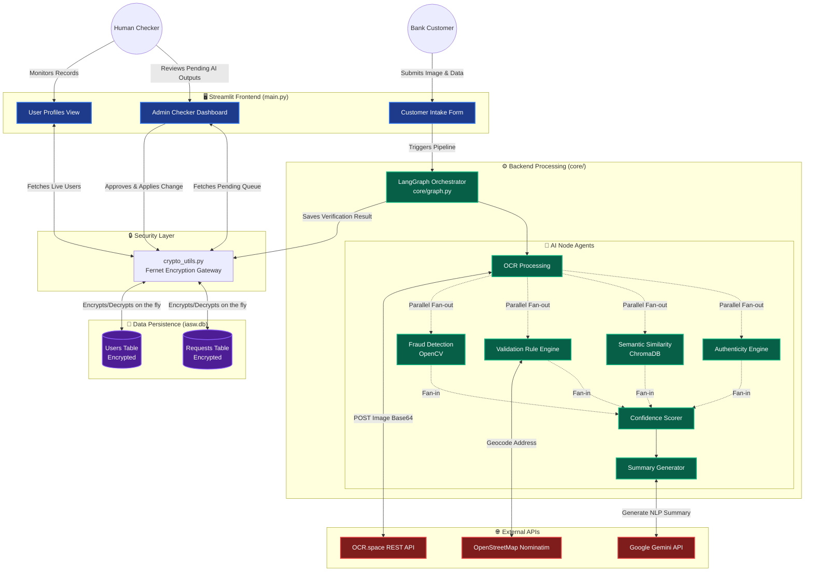

# IASW System Architecture

This document contains a high-level system architecture diagram for the Intelligent Account Servicing Workflow (IASW). It outlines the relationship between the Streamlit Frontend, the LangGraph Backend, External APIs, and the SQLite Database.

If your code editor supports Markdown Preview (like VS Code), you can open the preview to view the rendered diagram below.

## Component Breakdown

1. **Frontend (`main.py`)**: A Streamlit application handling Role-Based Access Control (RBAC). It separates the "Maker" (Customer submitting the form) and the "Checker" (Admin reviewing the AI output).
2. **Backend Orchestrator (`core/graph.py`)**: Uses `langgraph` to asynchronously manage the flow of data through specialized AI agents.
3. **AI Agents (`core/*.py`)**: Modular Python scripts handling specific verification tasks (OCR extraction, rule validation, semantic vector matching via ChromaDB, fraud detection using OpenCV heuristics, and generative summarization via Gemini).
4. **External Integrations**: Relies on `requests` to reach out to OCR.space, OpenStreetMap (for physical address validation), and the Google Gemini LLM API.
5. **Database (`core/database.py`)**: An SQLAlchemy-managed SQLite file (`iasw.db`) tracking all historical requests, confidence breakdowns, and acting as the source of truth for current user profile data.
